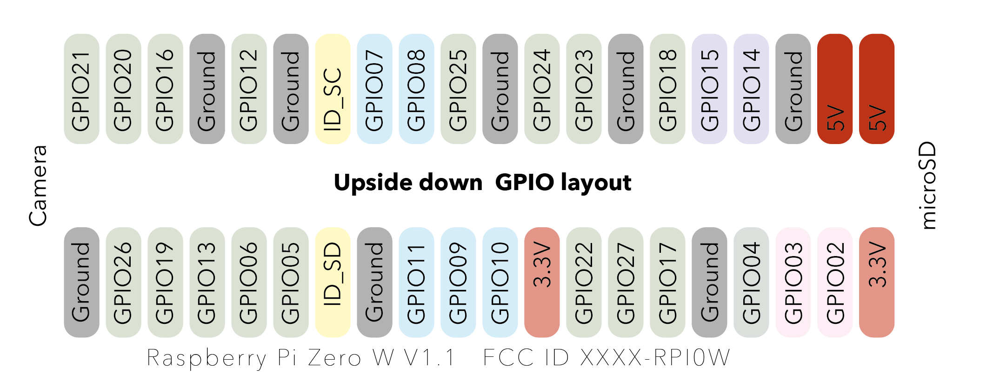
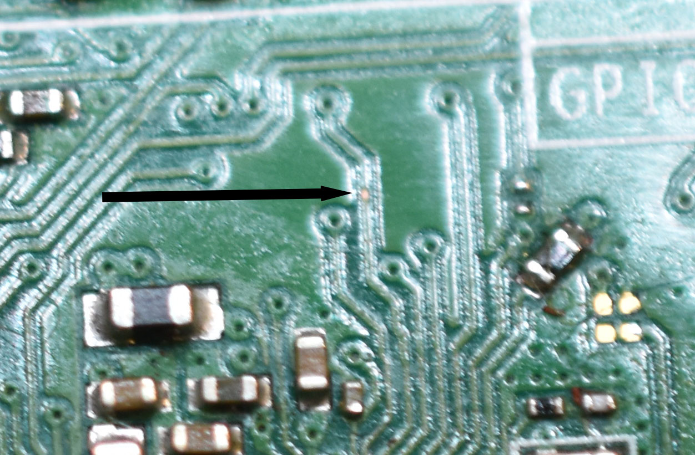
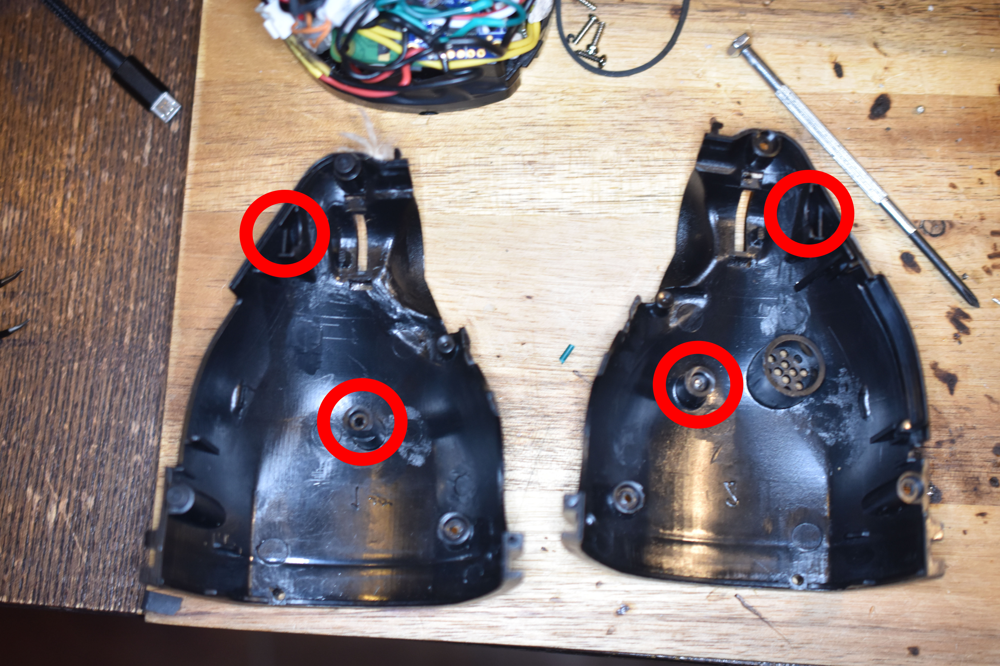
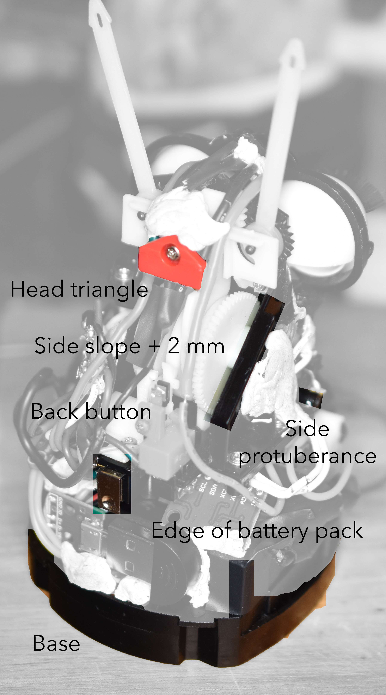

# Hardware

> Do note: my experise is coding, not EE

## Parts
The Furby has

* a 32Ω 0.25W speaker
* a mouth button
* a chest button (on the speaker)
* a back button
* an "inversion sensor" on the board (&rarr; gyroscope)
* mystery something next to mouth
* a motor, which runs slower between 2.5V-3.0V, at 5V it smells like copper
* a full revolution trigger (gets pressed when the motor does a revolution, eye wide open)
* small LED
* big LED
* photoresistor

### Mystery
By mystery something I mean these two cut wires (below the white mouth sensor):

They don't close the circuit under any scenario...

### New parts

Parts I have added:

* Pi Zero W with right angle header pins
* MPU-6050 Gyroscope
* TB6612 motor driver
* PAM8302A amp and a 10 nF ceramic capacitor
* 4x rechargeable AA (each 1.3V)
* a large red LED, a small green LED and a photoresistor just to fill the hole.
* USB PnP microphone

I also plan to replace the USB microphone with a I2S microphone, because the former is rather too sensitive to the slightest movement.

## Things to test

Based on a sample size of one, here are some suggestions to test for second hand Furbies off the web sold as is...

* test if it turns on —probably not
* test battery unit
* test motor (5V is fine)
* test mouth button (closing a 3V circuit with a white LED)
* test speaker

Mine had a dodgy battery unit (rusty and broken connector), so needed disassembly, scrubbing, WD40 and soldering a wire to overcome the broken connections.
Based on eBay this may be a common fault.

## Pi

So I really struggled to pack a Pi Zero between the body and the battery unit.

### Header pins

Regular header pins fit but not with wires on them, also there's a protuberance in the motor assembly.
I failed to solder wires on a Pi without them coming off etc. because I had solid core 22 gauge.
Maybe <22 gauge or higher threaded wires would have worked.
So I opted for the two-row angle header pins with a gap, which worked well. Namely,

* I clipped the headers and left a gap where GPIO9, GPIO11, GPIO25 and GPIO8 are —to avoid the protuberance.
* I trimmed the soldered ends down.
* I soldered the pins upside down as I wanted to use the testing pads PP1, PP6, PP22 and PP23.

Even though I am unable to do a splice properly I am very pleased with this solution.

Here is the GPIO pins as seen from the bottom face, i.e. pitched 180° (around the transverse axis) ([Adobe Illustrator file](images/upsidedown_GPIO.ai)):

Actually the first board had a defective wifi on account of a scratch on on it,
I must have done it as the trace runs to a test pad.
So apart from the confusion of the pins, soldering upside down may run the risk of damaging the components.

### Spaces

A key challenge is finding the space to put things. I started off adding JST connectors, but I quickly dropped that
because there was no space.
However, there is space, it just that there are no go spaces that have to contended with.
So all the wires and components are kept fixed with lots and lots of bluetack.

What fits in is limited by the shell. Here are key parts that need to be keep under close scrutiny.

The side protuberances slot into:

The parts internally that cannot be covered are:

### microphone

The shim + microphone does not fit in, even with the pi pushed as far back as it can go.

So two things were tried:

* Adafruit's DIY USB parts —
* PP1 + PP6 wired to a female breakout board

The former is a no go as the micro-USB is too long.

The latter was the primarily reason why the header was soldered upside down.
Namely, because I wanted to place a micro-USB female breakout module + shim + USB microphone on the top.

In hindsight it would have been great having slightly longer wires in order to run them out of the shell.

However, this was too thick, so I ended up placing the microphone above the reset button.

## Power

There are two power options:

* 4&times; AA rechargeable batteries in series (the Pi is fine with 5.2 V)
* micro-USB

Making it so that the batteries charge if powered by a microUSB was too much and would have required an extra board.

Whereas powering through the GPIO pins would have been fine too, 
I wired the battery pack, 
the micro-USB breakout board for power
and the micro-USB breakout board for the USB
to pins PP1 and PP6.

The Furby battery pack has two pads that stick through, cathode fore, anode aft,
these wired were passed in the passage under the the hinge, which was nice to get used.
In fact, there are a lot of dead spaces annoyingly.

(soldered side of header not yet trimmed)

the powering micro-USB board goes outside as there is a gap under the back button.

## Reset

I soldered two wires (in yellow, below) to the RUN pin holes, which when connected will start (or reset) a Pi.
The plan was to shutdown the Pi with `sudo shutdown now` and press the reset button to repower it.
However, the reset button had a spring which sprung off somewhere, so that is a fail.

## Boards
The Amp is small enough that it can go on the side. Also, a lot of GND wires... this is probably the worst wiring ever.

On a breadboard the speaker was fine powered by 5V, but tiny, but a 10 nF cap between the PWM GPIO13 wire and GND fixes it as expected.
I only have this size or the big boys (this works best). Maybe the PWM can be smoothed further, but it is clear enough.

While the gyroscope and the motor driver can go at the end of the battery pack topside.

One thing worth nothing is that a gyroscope has a correct orientation.
Namely one where forward is on the x-axis and upwards is on the z-axis.
Here I placed it at an angle, which means Earth gravity is not an acceleration on the z-axis alone.
However, this can be fixed by some vector calculus.

In hindsight, I would have wired ground and 5V differently, but the placement of the boards is fine.

The month sensor (white) wires were not too sturdy and came off easily, so I had to re-soldered them twice.
I should have desoldered and used a better wire.

I removed the internal board on the forehead, added a small green and a red LED and an unconnected photoresistor.
The LEDs work well even with the tinted cover.